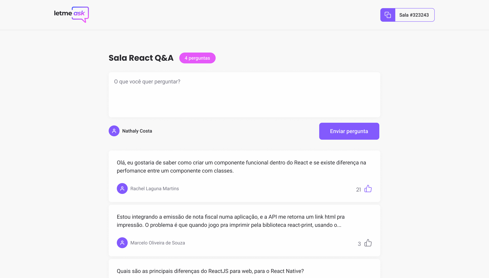

<h1 align="center">
  <a href="https://github.com/Joaomlg/letmeask-nlw6">
    </img>
  </a>
</h1>

<h1 align="center">🙋‍♂️ LetMeAsk</h1>

<p align="center">Every question has an answer! Learn and share knowledge with other people.</p>

## About

🙋‍♂️ LetMeAsk - is an app that allows you to create questions and answer rooms (Q&A). The admin can see the sended questions, and highlight it or check it as answered. And the participants can send your questions and like the others depending on their interest. It was develop during NextLevelWeek Together by [Rocketseat](https://blog.rocketseat.com.br/).

## 🎨 Design

You can see the layout of this project in [Figma](https://www.figma.com/file/u0BQK8rCf2KgzcukdRRCWh/Letmeask/duplicate)

<h4 align="center">
  </img>
</h4>

## ⚙ Future features

- [ ] Responsiveness
- [ ] PWA support
- [ ] Dark mode

## 🛠 Tecnologias

- ReactJS
- Typescript
- Firebase

## 🚀 How to run it

Prerequisites: [Environment configuration by Rocketseat](https://www.notion.so/Configura-es-do-ambiente-84c104da38fe4f51a31c1e2c757250fb)

```bash
# Clone this repository
$ git clone https://github.com/Joaomlg/letmeask-nlw6

# Go to project path
$ cd letmeask-nlw6

# Install dependences
$ yarn install

# Server app
$ yarn start
```
